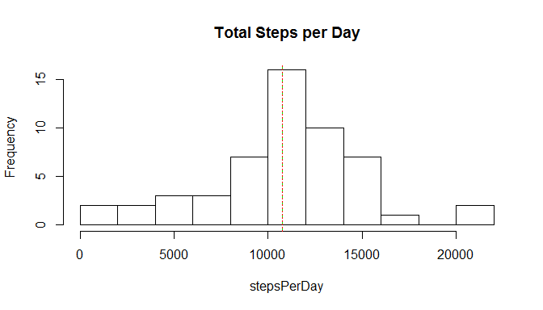
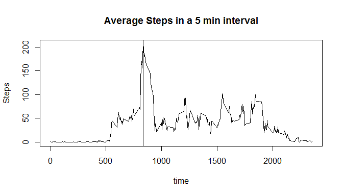
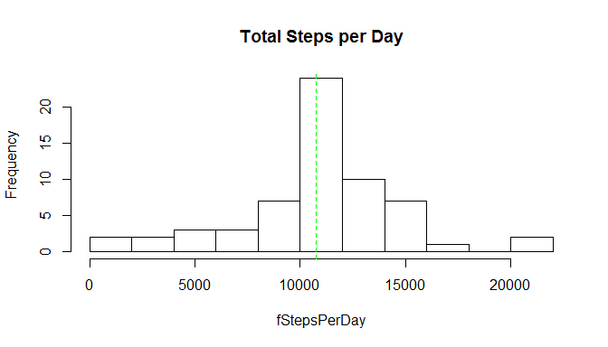

# Reproducible Research: Peer Assessment 1
Michael Crocco  


## Loading and preprocessing the data
File name is activity.csv and is located in activity.zip
Convert date variable class from factor to date

```r
activity <- read.table(unz("activity.zip", "activity.csv"), header=T, sep=",")
```
## What is mean total number of steps taken per day?
Melt and then re-cast the dataframe taking mean steps per day.
Show daily steps as a histagram

```r
library(reshape2)
melted <- melt(activity, id.vars=c("date", "interval"), measure.vars="steps",
                                   na.rm=TRUE)
dailyTotals <- dcast(melted, date ~ variable, sum)
stepsPerDay <- dailyTotals$steps
meanSteps <- mean(dailyTotals$steps, na.rm=TRUE)
medianSteps <- median(dailyTotals$steps, na.rm=TRUE)
```
The mean number of steps per day is: 1.0766189\times 10^{4}.  
The median number of steps per day is: 10765.

Plot histagram with vertical lines for mean and median

```r
hist(stepsPerDay, main="Total Steps per Day", breaks=10)
abline(v=meanSteps, col="green", lty=2)
abline(v=medianSteps, col="red", lty=3)
```

 
<p>## What is the average daily activity pattern?  
This time, melt with the interval as the id, and re-cast passing mean.

```r
intervalMeans <- dcast(melted, interval ~ variable, mean)
```
Create the time series plot, and find the busiest interval

```r
t <- intervalMeans$interval
y <- intervalMeans$steps
plot(t, y, type="l", main="Average Steps in a 5 min interval",
     ylab="Steps", xlab="time")
maxSteps <- max(intervalMeans$steps)
busiest <- intervalMeans$interval[with(intervalMeans, steps == maxSteps)]
abline(v=busiest)
```

 
<p> The buisiest interval is that at 835 minutes.


## Imputing missing values  
Fill missing steps values with mean for the interval  
Compute the number of missing values (missing)  
Create a new, filled, dataset (fillData)


```r
#missing <- sum(!complete.cases(activity))
nulls <- which(is.na(activity$steps))
missing <- length(nulls)
fillData <- activity

for (i in 1:length(nulls)){
        imputed <- intervalMeans$steps[intervalMeans$interval == fillData[nulls[i],3]]
        fillData[nulls[i],1] <- imputed
}
```
Number of missing values in the original dataset: 2304  

Repeat the histogram and mean, median calcs.

```r
fMelted <- melt(fillData, id.vars=c("date", "interval"), measure.vars="steps",
                                   na.rm=TRUE)
fDailyTotals <- dcast(fMelted, date ~ variable, sum)
fStepsPerDay <- fDailyTotals$steps
fMeanSteps <- mean(fStepsPerDay, na.rm=TRUE)
fMedianSteps <- median(fStepsPerDay, na.rm=TRUE)
hist(fStepsPerDay, main="Total Steps per Day", breaks = 10)
abline(v=fMeanSteps, col="green", lty=2)
```

 
<p>The mean number of steps per day is: 1.0766189\times 10^{4}    
The median number of steps per day is: 1.0766189\times 10^{4}  
This method of imputing has resulted in equating the mean and median steps per day.  Also, the mean has remained equal to the first dataset, without imputed values.  

## This method of imputing values was effectively pointless!


## Are there differences in activity patterns between weekdays and weekends?
Create a new factor variable in the filled in dataset with options of "weekend" and "weekday".  
Create a panel of time series plots with average number of stpes averaged across week day and weekend days.  

First, mutate the dataframe.

```r
wknd <- c("Saturday", "Sunday")
fillData$weekday <- factor(weekdays(as.Date(fillData$date)) %in% wknd, labels=c("weekday","weekend"))
```

Then create the plot.

```r
fMelted <- melt(fillData, id.vars=c("interval", "weekday"),
                measure.vars="steps")
data <- dcast(fMelted, weekday + interval ~ variable, mean)
library(lattice)
xyplot(steps~interval|weekday, data, type = "l", layout=c(1,2))
```

 

There are clear differences between weekday and weekend activity profiles:  
1. Weekdays are characterised by a high level of activity early in the day compared to weekends (going to work).  
2. Weekends are characterised by a more consistent level of activity througout the day (less sedantary as typified by a office work)
